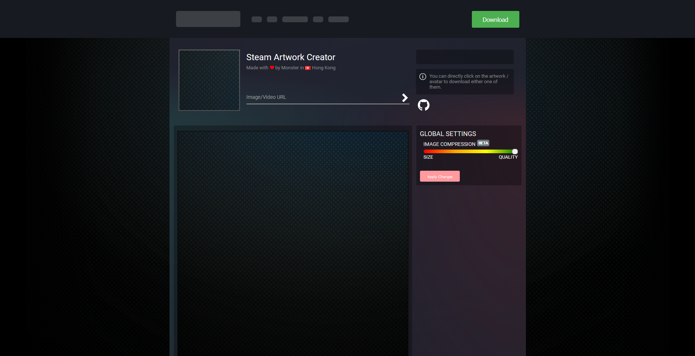
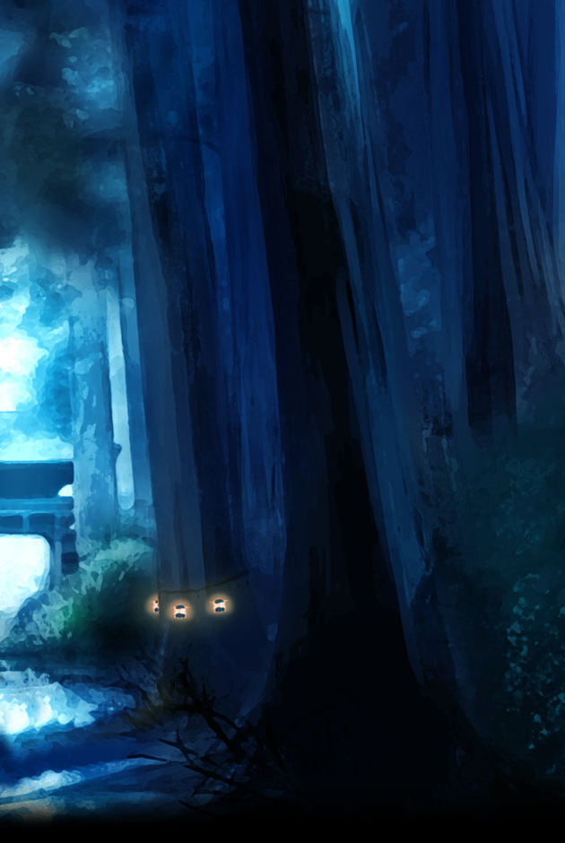

<br />
<p align="center">
  <a href="https://github.com/Monster030/steam-artwork">
    
  </a>

  <h3 align="center">Steam Artwork Creator</h3>

  <p align="center">
    Creating new Steam Feature Artwork
    <br/>
    <a href="https://artwork2020.m0n5ter.com/">View Demo</a>
    ·
    <a href="https://github.com/Monster030/steam-artwork/issues">Report Bug</a>
    ·
    <a href="https://github.com/Monster030/steam-artwork/issues">Request Feature</a>
  </p>
</p>


<!-- TABLE OF CONTENTS -->
<details open="open">
  <summary>Table of Contents</summary>
  <ol>
    <li>
      <a href="#about-the-project">About The Project</a>
      <ul>
        <li><a href="#example-output">Example output</a></li>
        <li><a href="#built-with">Built With</a></li>
      </ul>
    </li>
    <li>
      <a href="#getting-started">Getting Started</a>
      <ul>
        <li><a href="#installation">Installation</a></li>
      </ul>
    </li>
    <li><a href="#roadmap">Roadmap</a></li>
    <li><a href="#contributing">Contributing</a></li>
    <li><a href="#license">License</a></li>
  </ol>
</details>


<!-- ABOUT THE PROJECT -->
## About The Project

[](https://artwork2020.m0n5ter.com/)

In Dec 2020, Steam created a new artwork showcase. This project aim to create the cropped background image in one click.

### Example output
* Artwork: (630xheight)<br/>

* Avatar: (164x164)<br/>


### Built With

* [Vuejs](https://vuejs.org)


<!-- GETTING STARTED -->
## Getting Started

### Installation

1. Clone the repo
   ```sh
   git clone https://github.com/Monster030/steam-artwork.git
   ```
2. Install NPM packages via yarn
   ```sh
   yarn
   ```
3. Start a local development server
   ```sh
   yarn serve
   ```
4. Go to [localhost:8080](http://localhost:8080/)


<!-- ROADMAP -->
## Roadmap

See the [open issues](https://github.com/Monster030/steam-artwork/issues) for a list of proposed features (and known issues).


<!-- CONTRIBUTING -->
## Contributing

Contributions are what make the open source community such an amazing place to be learn, inspire, and create. Any contributions you make are **highly appreciated**.

1. Fork the Project
2. Create your Feature Branch (`git checkout -b feat/SomeFeature`)
3. Commit your Changes (`git commit -m 'Add some SomeFeature'`)
4. Push to the Branch (`git push origin feat/SomeFeature`)
5. Open a Pull Request


<!-- LICENSE -->
## License

Distributed under the MIT License. See `LICENSE` for more information.